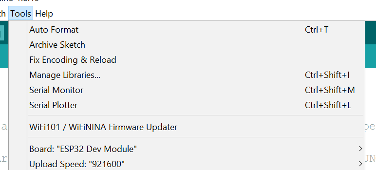

# ESP32/ESP8266: Working with Deta Base (Dynamic)
This is part 2 of a 2 part tutorial on using Deta Base with an ESP32 running the Arduino core. This tutorial focuses on sending and receiving dynamic data(such as continuous values from a sensor). The first tutorial focuses on getting set up and fixed data.

This tutorial focuses on using an ESP32/ESP8266 to interface with a Deta Base instance using the [`ArduinoJson`](https://arduinojson.org/) library to facilitate JSON serialization, deserialization, and processing. Deta Base is online NoSQL database, which is free to use and unlimited. These qualities make it perfect for experimental projects and hackathons.

By the end of this tutorial, you will be able to serialize(pack) JSON objects containing values read from a potentiometer, upload them to the database, retrieve values from the database, and deserialize(unpack) them.

This project assumes basic familiarity with Deta Base and using the [`detaBaseArduinoESP32`](https://github.com/A223D/detaBaseArduinoESP32) to send data to the Base instance.

## Deta Base Setup
This tutorial assumes that  a Deta project is set up with a Deta project ID, project key, and Base name in hand. If needed, the previous part goes over setting up a Deta Base instance. 

## ArduinoJson Setup
`ArduinoJson` is a library that makes it easy to work with JSON object in Arduino. This library is available for free in the Arduino Library Manager, and is required for this tutorial. To install this library, open the Arduino IDE and under the `Tools` menu, click on `Manage Libraries`.
 
Search for `ArduinoJSON` and click install.
 

## Arduino Code
We include the libraries from the previous tutorial, along with `ArduinoJson`.
```c++
#include <ArduinoJson.h>
#include <detaBaseArduinoESP32.h>
#include <WiFiClientSecure.h>
```
We define our Deta project ID, project key(API key), and base name, in the same way we did last time. We then declare a `WiFiClientSecure` object called `client`, and then pass `client` to the constructor of a `DetaBaseObject` object.
After that, we create a `StaticJsonDocument` of size 50 called `outer`. This will hold the JSON object that we will be sending to the online Base instance. The size 50 is a guesstimate, and should be adjusted based on how large your object could possibly be. From the [ArduinoJson Docs](https://arduinojson.org/v6/api/jsondocument/#staticjsondocument-vs-dynamicjsondocument), we can choose either [`DynamicJsonDocument`](https://arduinojson.org/v6/api/dynamicjsondocument/) or [`StaticJsonDocument`](https://arduinojson.org/v6/api/staticjsondocument/) depending on the size of our JSON object. I have decided to go with `StaticJsonDocument`.
```c++
char* apiKey = "MY_KEY";
char* detaID = "MY_ID";
char* detaBaseName = "MY_BASE";

WiFiClientSecure client;
DetaBaseObject detaObj(client, detaID, detaBaseName, apiKey, true);
StaticJsonDocument<50> outer;
``` 